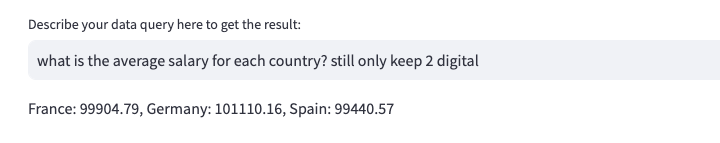
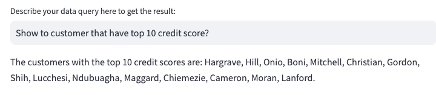
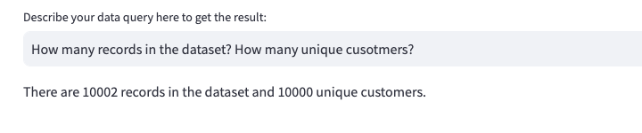

# Auto GPT: Data Query using Natural Language

This is an Auto GPT APP for query your own data using natural language.
All you need to do is to descript the query in natural language, and the app will get the result for you.





## How to use

### Step 1: Install the requirements

```shell
pip install -r requirements.txt
```

### Step 2: Put your OpenAI API key in `apikey-template.py`, and rename it to `apikey.py`

### Step 3: Run the app script

```shell
streamlit run app.py
```

### Step 4: Descript the query in natural language. Example:

-   `What is the total number of customers in each country?`
-   `Show to customer that have top 10 credit score?`

# About the Example Data

The example data is an open-source bank customer dataset. The schema of the data is as below:

-   `Customer ID`: A unique identifier for each customer
-   `Surname`: The customer's surname or last name
-   `Credit Score`: A numerical value representing the customer's credit score
-   `Geography`: The country where the customer resides (France, Spain or Germany)
-   `Gender`: The customer's gender (Male or Female)
-   `Age`: The customer's age.
-   `Tenure`: The number of years the customer has been with the bank
-   `Balance`: The customer's account balance
-   `NumOfProducts`: The number of bank products the customer uses (e.g., savings account, credit card)
-   `HasCrCard`: Whether the customer has a credit card (1 = yes, 0 = no)
-   `IsActiveMember`: Whether the customer is an active member (1 = yes, 0 = no)
-   `EstimatedSalary`: The estimated salary of the customer
-   `Exited`: Whether the customer has churned (1 = yes, 0 = no)

**_You can change it to your own data, and the app will work as well._**
